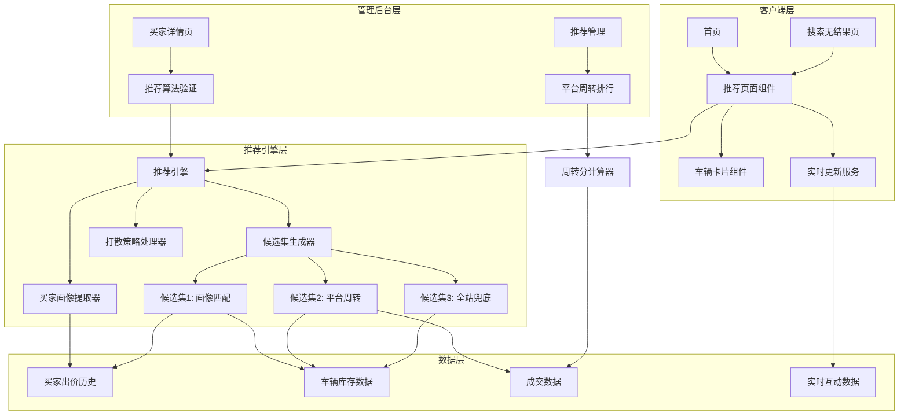

# 设计文档 - 车辆推荐系统

## 概述

车辆推荐系统是一个为B2B二手车拍卖平台提供个性化推荐的智能系统。系统采用三层候选集策略（画像匹配、平台周转、全站兜底），结合打散算法确保推荐多样性。系统包含客户端推荐展示模块和管理后台验证工具。

### 核心目标
- 提升模块出价率10%-15%
- 提高推荐模块点击率(CTR)
- 为买家提供个性化、多样化的车源推荐
- 为运营人员提供算法验证和数据分析工具

### 技术栈
- 前端：React + Vite + Tailwind CSS
- 状态管理：React Hooks (useState, useEffect)
- 数据获取：Fetch API / Axios
- 组件库：现有 CarRecommendation 组件结构

## 架构

### 系统架构图



### 数据流

1. **推荐生成流程**:
   - 买家访问 → 提取买家ID → 查询90天出价历史 → 生成买家画像
   - 生成候选集1（画像匹配）→ 生成候选集2（平台周转）→ 生成候选集3（兜底）
   - 合并候选集 → 应用打散策略 → 返回推荐列表

2. **实时更新流程**:
   - 前端定时器（30秒）→ 请求车辆互动数据 → 更新卡片展示
   - 检测车辆状态变化 → 移除失效车辆 → 补充新推荐

3. **管理后台验证流程**:
   - 运营人员选择买家 → 调用推荐引擎 → 生成30条推荐 → 标注推荐逻辑

## 组件和接口

### 前端组件

#### 1. RecommendationPage 组件
**职责**: 推荐页面容器，管理推荐列表状态和实时更新

**Props**:
```typescript
interface RecommendationPageProps {
  buyerId: string;           // 买家ID
  displayContext: 'homepage' | 'no-results';  // 展示位置
  initialCount?: number;     // 初始加载数量，默认10
}
```

**State**:
```typescript
interface RecommendationPageState {
  recommendations: Vehicle[];     // 推荐车辆列表
  loading: boolean;              // 加载状态
  error: string | null;          // 错误信息
  lastUpdateTime: number;        // 最后更新时间戳
}
```

**主要方法**:
- `fetchRecommendations()`: 获取推荐列表
- `refreshInteractionData()`: 刷新互动数据（每30秒）
- `handleVehicleClick(vehicleId)`: 处理车辆点击事件
- `removeInvalidVehicles()`: 移除失效车辆并补充新推荐

#### 2. VehicleCard 组件
**职责**: 展示单个车辆信息卡片

**Props**:
```typescript
interface VehicleCardProps {
  vehicle: Vehicle;              // 车辆数据
  position: number;              // 推荐位序号
  onClick: (vehicleId: string) => void;  // 点击回调
}
```

**展示内容**:
- 基本信息：品牌车系、车型、车牌、国别、所在地
- 车辆参数：表显里程、车龄、车况评分
- 价格信息：起拍价、倒计时
- 互动数据：浏览次数/UV、出价次数/人数
- 促销标签：围观人数/多人意向/快速周转（按优先级）

#### 3. PromotionTag 组件
**职责**: 展示促销标签

**Props**:
```typescript
interface PromotionTagProps {
  vehicle: Vehicle;  // 车辆数据（用于判断标签类型）
}
```

**标签优先级逻辑**:
1. 围观人数（浏览UV > 阈值）
2. 多人意向（出价人数 > 3）
3. 快速周转（周转分 > 70）

### 后端API接口

#### 1. 获取推荐列表
```typescript
GET /api/recommendations/:buyerId

Query Parameters:
- count: number (默认10，管理后台固定30)
- context: 'client' | 'admin'

Response:
{
  success: boolean;
  data: {
    recommendations: Vehicle[];
    totalCount: number;
    generatedAt: string;  // ISO 8601时间戳
  }
}
```

#### 2. 获取车辆实时数据
```typescript
GET /api/vehicles/interaction-data

Query Parameters:
- vehicleIds: string[]  // 车辆ID数组

Response:
{
  success: boolean;
  data: {
    [vehicleId: string]: {
      viewCount: number;
      viewUV: number;
      bidCount: number;
      bidderCount: number;
      status: 'active' | 'ended' | 'removed';
      countdown: number;  // 剩余秒数
    }
  }
}
```

#### 3. 获取推荐算法验证（管理后台）
```typescript
GET /api/admin/recommendations/verify/:buyerId

Response:
{
  success: boolean;
  data: {
    buyerId: string;
    buyerProfile: BuyerProfile | null;
    recommendations: Array<{
      position: number;
      vehicle: Vehicle;
      reason: string;  // 推荐逻辑说明
      candidateSet: 1 | 2 | 3;  // 来源候选集
    }>;
  }
}
```

#### 4. 获取平台周转排行
```typescript
GET /api/admin/turnover-ranking

Query Parameters:
- seriesId?: string  // 可选，展开特定车系的车型

Response:
{
  success: boolean;
  data: {
    series: Array<{
      seriesId: string;
      seriesName: string;
      avgDealRate: number;      // 平均成交率
      medianDealTime: number;   // 成交耗时中位数（小时）
      turnoverScore: number;    // 综合周转分
      models?: Array<{          // 展开时返回
        modelId: string;
        modelName: string;
        dealRate: number;
        medianDealTime: number;
        turnoverScore: number;
        activeCount: number;    // 在拍数量
      }>;
    }>;
  }
}
```

### 推荐引擎核心接口

#### RecommendationEngine 类
```typescript
class RecommendationEngine {
  // 生成推荐列表
  generateRecommendations(
    buyerId: string, 
    count: number
  ): Promise<RecommendedVehicle[]>;
  
  // 提取买家画像
  extractBuyerProfile(
    buyerId: string
  ): Promise<BuyerProfile | null>;
  
  // 生成候选集1：画像匹配
  generateCandidateSet1(
    profile: BuyerProfile
  ): Promise<Vehicle[]>;
  
  // 生成候选集2：平台周转
  generateCandidateSet2(): Promise<Vehicle[]>;
  
  // 生成候选集3：全站兜底
  generateCandidateSet3(): Promise<Vehicle[]>;
  
  // 应用打散策略
  applyDiversityStrategy(
    vehicles: Vehicle[]
  ): Vehicle[];
}
```

#### BuyerProfileExtractor 类
```typescript
class BuyerProfileExtractor {
  // 分析出价历史
  analyzeBidHistory(
    buyerId: string, 
    days: number
  ): Promise<BidRecord[]>;
  
  // 识别主打车系
  identifyPreferredSeries(
    bidHistory: BidRecord[]
  ): string[];
  
  // 识别偏好价位区间
  identifyPriceRange(
    bidHistory: BidRecord[]
  ): PriceRange;
  
  // 识别偏好车龄
  identifyPreferredAge(
    bidHistory: BidRecord[]
  ): { min: number; max: number };
  
  // 判断画像数据是否充足
  isProfileSufficient(
    bidHistory: BidRecord[]
  ): boolean;
}
```

#### TurnoverScoreCalculator 类
```typescript
class TurnoverScoreCalculator {
  // 计算车型周转分
  calculateModelScore(
    modelId: string
  ): Promise<TurnoverScore | null>;
  
  // 计算成交率评分
  calculateDealRateScore(
    dealCount: number, 
    listingCount: number
  ): number;
  
  // 计算耗时评分
  calculateTimeScore(
    medianTime: number, 
    maxTime: number
  ): number;
  
  // 获取TOP N车型
  getTopModels(
    n: number
  ): Promise<ModelScore[]>;
  
  // 检查样本量是否充足
  isSampleSufficient(
    listingCount: number, 
    dealCount: number
  ): boolean;
}
```

#### DiversityStrategy 类
```typescript
class DiversityStrategy {
  // 应用打散规则
  applyDiversity(
    vehicles: Vehicle[], 
    topN: number
  ): Vehicle[];
  
  // 检查品牌连续性
  checkBrandConsecutive(
    vehicles: Vehicle[], 
    maxConsecutive: number
  ): boolean;
  
  // 检查车系连续性
  checkSeriesConsecutive(
    vehicles: Vehicle[], 
    maxConsecutive: number
  ): boolean;
  
  // 重排序以满足打散规则
  reorderForDiversity(
    vehicles: Vehicle[]
  ): Vehicle[];
}
```

## 数据模型

### Vehicle（车辆）
```typescript
interface Vehicle {
  id: string;
  brandId: string;
  brandName: string;
  seriesId: string;
  seriesName: string;
  modelId: string;
  modelName: string;
  licensePlate: string;
  country: string;           // 国别
  location: string;          // 所在地
  mileage: number;           // 表显里程（公里）
  age: number;               // 车龄（年）
  conditionScore: number;    // 车况评分（0-100）
  startPrice: number;        // 起拍价（元）
  currentPrice: number;      // 当前价（元）
  endTime: string;           // 竞价结束时间（ISO 8601）
  status: 'active' | 'ended' | 'removed';
  
  // 互动数据
  viewCount: number;         // 浏览次数
  viewUV: number;            // 浏览人数
  bidCount: number;          // 出价次数
  bidderCount: number;       // 出价人数
  
  // 周转数据（可选）
  turnoverScore?: number;    // 车型周转分
}
```

### BuyerProfile（买家画像）
```typescript
interface BuyerProfile {
  buyerId: string;
  preferredSeries: string[];      // 主打车系ID列表
  priceRange: PriceRange;         // 偏好价位区间
  ageRange: {                     // 偏好车龄范围
    min: number;
    max: number;
  };
  bidCount: number;               // 90天出价次数
  lastBidTime: string;            // 最后出价时间
  confidence: 'high' | 'medium' | 'low';  // 画像置信度
}
```

### PriceRange（价位区间）
```typescript
type PriceRange = 
  | '0-3万'
  | '3-5万'
  | '5-8万'
  | '8-15万'
  | '15-20万'
  | '20万+';

// 辅助函数
function getPriceRangeBounds(range: PriceRange): { min: number; max: number } {
  const ranges = {
    '0-3万': { min: 0, max: 30000 },
    '3-5万': { min: 30000, max: 50000 },
    '5-8万': { min: 50000, max: 80000 },
    '8-15万': { min: 80000, max: 150000 },
    '15-20万': { min: 150000, max: 200000 },
    '20万+': { min: 200000, max: Infinity }
  };
  return ranges[range];
}
```

### BidRecord（出价记录）
```typescript
interface BidRecord {
  id: string;
  buyerId: string;
  vehicleId: string;
  brandId: string;
  seriesId: string;
  modelId: string;
  bidPrice: number;
  bidTime: string;           // ISO 8601
  vehicleAge: number;
  vehiclePrice: number;      // 当时车辆价格
}
```

### TurnoverScore（周转分）
```typescript
interface TurnoverScore {
  modelId: string;
  modelName: string;
  seriesId: string;
  seriesName: string;
  listingCount: number;      // 上架数
  dealCount: number;         // 成交数
  dealRate: number;          // 成交率（%）
  medianDealTime: number;    // 成交耗时中位数（小时）
  dealRateScore: number;     // 成交率评分（0-100）
  timeScore: number;         // 耗时评分（0-100）
  turnoverScore: number;     // 综合周转分（0-100）
  calculatedAt: string;      // 计算时间
}
```

### RecommendedVehicle（推荐车辆）
```typescript
interface RecommendedVehicle extends Vehicle {
  position: number;          // 推荐位序号
  candidateSet: 1 | 2 | 3;  // 来源候选集
  reason: string;            // 推荐理由
  matchScore?: number;       // 匹配分数（候选集1使用）
}
```

### ModelScore（车型评分）
```typescript
interface ModelScore {
  modelId: string;
  modelName: string;
  seriesId: string;
  seriesName: string;
  turnoverScore: number;
  activeCount: number;       // 当前在拍数量
}
```

## 核心算法

### 1. 买家画像提取算法

```
算法：extractBuyerProfile(buyerId, days=90)
输入：买家ID，分析天数
输出：BuyerProfile 或 null

步骤：
1. 查询买家最近90天的出价记录
2. IF 出价记录数 < 3 THEN
     RETURN null  // 数据不足
3. 统计各车系出价频次，选择频次最高的前3个作为主打车系
4. 统计各价位区间出价频次，选择众数区间作为偏好价位
5. 计算出价车辆车龄的中位数median_age
6. 设置偏好车龄范围为 [median_age - 2, median_age + 2]
7. 根据出价次数设置置信度：
   - >= 10次：high
   - 5-9次：medium
   - 3-4次：low
8. RETURN BuyerProfile对象
```

### 2. 候选集生成算法

#### 候选集1：画像匹配
```
算法：generateCandidateSet1(profile)
输入：BuyerProfile
输出：Vehicle[]

步骤：
1. IF profile is null THEN RETURN []
2. 查询条件：
   - 车系 IN profile.preferredSeries
   - 价格 IN profile.priceRange的范围
   - 车龄 IN profile.ageRange
   - 状态 = 'active'
3. 按以下优先级排序：
   - 车系匹配度（主打车系优先）
   - 价格接近度（越接近区间中位数越好）
   - 结束时间升序
4. 取前50条
5. RETURN 结果列表
```

#### 候选集2：平台周转
```
算法：generateCandidateSet2()
输出：Vehicle[]

步骤：
1. 调用 TurnoverScoreCalculator.getTopModels(50)
2. 获取TOP 50车型列表
3. 对每个车型，查询当前在拍的车辆（status='active'）
4. 合并所有车辆，按周转分降序排序
5. 应用同车系占比限制：
   - 统计各车系车辆数
   - IF 某车系占比 > 50% THEN
       移除该车系中周转分较低的车辆，直到占比 <= 50%
6. RETURN 结果列表
```

#### 候选集3：全站兜底
```
算法：generateCandidateSet3()
输出：Vehicle[]

步骤：
1. 查询所有 status='active' 的车辆
2. 排序规则：
   - 主排序：endTime 升序（即将结束的优先）
   - 次排序：bidCount 降序（出价多的优先）
3. 取前100条
4. RETURN 结果列表
```

### 3. 推荐列表生成算法

```
算法：generateRecommendations(buyerId, count)
输入：买家ID，需要数量
输出：RecommendedVehicle[]

步骤：
1. profile = extractBuyerProfile(buyerId, 90)
2. candidates1 = generateCandidateSet1(profile)
3. candidates2 = generateCandidateSet2()
4. candidates3 = generateCandidateSet3()

5. 合并候选集（去重，优先级：1 > 2 > 3）：
   merged = []
   seen = Set()
   
   FOR vehicle IN candidates1:
     IF vehicle.id NOT IN seen THEN
       merged.add({...vehicle, candidateSet: 1, reason: "画像匹配-主打车型"})
       seen.add(vehicle.id)
   
   FOR vehicle IN candidates2:
     IF vehicle.id NOT IN seen THEN
       merged.add({...vehicle, candidateSet: 2, reason: "候选车源-同车型高频成交"})
       seen.add(vehicle.id)
   
   FOR vehicle IN candidates3:
     IF vehicle.id NOT IN seen THEN
       merged.add({...vehicle, candidateSet: 3, reason: "兜底-平台热销"})
       seen.add(vehicle.id)

6. 应用打散策略到前10位：
   diversified = applyDiversityStrategy(merged, 10)

7. 添加推荐位序号：
   FOR i, vehicle IN enumerate(diversified):
     vehicle.position = i + 1

8. 取前count条
9. RETURN diversified[:count]
```

### 4. 打散策略算法

```
算法：applyDiversityStrategy(vehicles, topN=10)
输入：车辆列表，需要打散的前N位
输出：打散后的车辆列表

步骤：
1. IF vehicles.length <= topN THEN
     RETURN vehicles  // 数量不足，无需打散

2. top = vehicles[:topN]
3. rest = vehicles[topN:]

4. 初始化结果列表 result = []
5. 初始化待处理列表 pending = top.copy()

6. WHILE pending is not empty:
     found = false
     
     FOR vehicle IN pending:
       // 检查品牌连续性（不超过3台）
       brandOk = checkBrandConsecutive(result, vehicle, 3)
       
       // 检查车系连续性（不超过2台）
       seriesOk = checkSeriesConsecutive(result, vehicle, 2)
       
       IF brandOk AND seriesOk THEN
         result.add(vehicle)
         pending.remove(vehicle)
         found = true
         BREAK
     
     // 如果没有找到符合条件的，优先满足车系规则
     IF NOT found THEN
       FOR vehicle IN pending:
         seriesOk = checkSeriesConsecutive(result, vehicle, 2)
         IF seriesOk THEN
           result.add(vehicle)
           pending.remove(vehicle)
           found = true
           BREAK
     
     // 如果还是没找到，直接添加第一个
     IF NOT found THEN
       result.add(pending[0])
       pending.remove(pending[0])

7. RETURN result + rest

辅助函数：
checkBrandConsecutive(list, vehicle, maxConsecutive):
  IF list.length < maxConsecutive THEN RETURN true
  recent = list[-(maxConsecutive-1):]
  consecutiveCount = 0
  FOR v IN recent:
    IF v.brandId == vehicle.brandId THEN
      consecutiveCount += 1
  RETURN consecutiveCount < maxConsecutive - 1

checkSeriesConsecutive(list, vehicle, maxConsecutive):
  IF list.length < maxConsecutive THEN RETURN true
  recent = list[-(maxConsecutive-1):]
  consecutiveCount = 0
  FOR v IN recent:
    IF v.seriesId == vehicle.seriesId THEN
      consecutiveCount += 1
  RETURN consecutiveCount < maxConsecutive - 1
```

### 5. 周转分计算算法

```
算法：calculateModelScore(modelId, days=30)
输入：车型ID，统计天数
输出：TurnoverScore 或 null

步骤：
1. 查询最近30天该车型的上架和成交数据
2. listingCount = 上架总数
3. dealCount = 成交总数

4. IF listingCount < 6 OR dealCount < 3 THEN
     RETURN null  // 样本量不足

5. 计算成交率：
   dealRate = (dealCount / listingCount) × 100

6. 计算成交率评分：
   dealRateScore = dealRate  // 直接使用百分比

7. 计算成交耗时中位数（小时）：
   dealTimes = [成交车辆的上架到成交耗时列表]
   medianDealTime = median(dealTimes)

8. 获取全站最大耗时：
   maxTime = 查询最近30天所有成交车辆的最大耗时

9. 计算耗时评分：
   timeScore = 100 - (medianDealTime / maxTime) × 100
   timeScore = max(0, timeScore)  // 确保非负

10. 计算综合周转分：
    turnoverScore = dealRateScore × 0.7 + timeScore × 0.3

11. RETURN TurnoverScore对象
```

### 6. 促销标签优先级算法

```
算法：getPromotionTag(vehicle)
输入：Vehicle对象
输出：标签文本 或 null

步骤：
1. // 优先级1：围观人数
   IF vehicle.viewUV >= 围观阈值 THEN
     RETURN "围观人数"

2. // 优先级2：多人意向
   IF vehicle.bidderCount > 3 THEN
     RETURN "多人意向"

3. // 优先级3：快速周转
   IF vehicle.turnoverScore > 70 THEN
     RETURN "快速周转"

4. RETURN null  // 无标签
```


## 正确性属性

*属性是一个特征或行为，应该在系统的所有有效执行中保持为真——本质上是关于系统应该做什么的形式化陈述。属性作为人类可读规范和机器可验证正确性保证之间的桥梁。*

### 属性 1: 推荐列表最小数量保证
*对于任意*买家ID，生成的推荐列表应包含至少10条推荐车辆（除非全站可用车辆不足10条）
**验证需求: 1.3**

### 属性 2: 推荐位序号连续性
*对于任意*推荐列表，车辆的推荐位序号应从1开始连续递增，不存在跳号或重复
**验证需求: 1.4**

### 属性 3: 候选集1画像匹配准确性
*对于任意*有效的买家画像和候选集1，候选集1中的所有车辆应满足：车系在主打车系列表中，价格在偏好价位区间内，车龄在偏好车龄范围内
**验证需求: 2.1**

### 属性 4: 候选集2车系占比限制
*对于任意*候选集2，任意单个车系的车辆数量占比应不超过50%
**验证需求: 2.4**

### 属性 5: 周转分计算公式正确性
*对于任意*成交率评分和耗时评分，综合周转分应等于：成交率评分×0.7 + 耗时评分×0.3
**验证需求: 2.5, 9.3**

### 属性 6: 周转分样本量过滤
*对于任意*车型，如果其上架数<6或成交数<3，则不应计算周转分（返回null）
**验证需求: 2.6, 9.4**

### 属性 7: 候选集3排序规则
*对于任意*候选集3，车辆应按结束时间升序排列，结束时间相同时按出价次数降序排列
**验证需求: 2.7**

### 属性 8: 品牌打散规则
*对于任意*推荐列表的前10位，任意连续3台车辆中，不应存在3台都是同一品牌的情况
**验证需求: 3.1**

### 属性 9: 车系打散规则
*对于任意*推荐列表的前10位，任意连续2台车辆不应都是同一车系
**验证需求: 3.2**

### 属性 10: 车辆卡片信息完整性
*对于任意*车辆卡片渲染结果，应包含以下所有字段：品牌车系、车型、车牌、国别、所在地、表显里程、车龄、车况评分、价格信息、倒计时、浏览次数、浏览UV、出价次数、出价人数
**验证需求: 4.1, 4.2, 4.3**

### 属性 11: 促销标签优先级正确性
*对于任意*符合多个促销标签条件的车辆，返回的标签应按优先级选择：围观人数 > 多人意向 > 快速周转
**验证需求: 4.4**

### 属性 12: 促销标签唯一性
*对于任意*车辆，最多只应显示一个促销标签
**验证需求: 4.5**

### 属性 13: 管理后台推荐数量固定
*对于任意*买家ID，管理后台推荐验证功能应返回固定30条推荐车源
**验证需求: 6.3**

### 属性 14: 管理后台推荐数据完整性
*对于任意*管理后台推荐结果，每条记录应包含：推荐位序号、车辆基本信息、互动数据、推荐逻辑说明（reason字段非空）
**验证需求: 6.4, 6.5, 6.6**

### 属性 15: 周转排行降序排列
*对于任意*平台周转排行列表，车系应按综合周转分严格降序排列
**验证需求: 7.2**

### 属性 16: 周转排行数据完整性
*对于任意*周转排行中的车系记录，应包含：车系名称、平均成交率、成交耗时中位数、综合评分
**验证需求: 7.3**

### 属性 17: 买家画像时间范围
*对于任意*买家画像提取，应仅使用最近90天内的出价记录
**验证需求: 8.1**

### 属性 18: 主打车系识别准确性
*对于任意*出价记录集合，识别的主打车系应是出价频次最高的车系
**验证需求: 8.2**

### 属性 19: 偏好价位区间识别准确性
*对于任意*出价记录集合，识别的偏好价位区间应是出价车辆价格的众数区间
**验证需求: 8.3**

### 属性 20: 偏好车龄范围计算准确性
*对于任意*出价记录集合，识别的偏好车龄范围应为：[中位数车龄 - 2, 中位数车龄 + 2]
**验证需求: 8.4**

### 属性 21: 成交率评分计算准确性
*对于任意*车型成交数和上架数，成交率评分应等于：(成交数 / 上架数) × 100
**验证需求: 9.1**

### 属性 22: 耗时评分计算准确性
*对于任意*成交耗时中位数和最大耗时，耗时评分应等于：max(0, 100 - (中位数 / 最大耗时) × 100)
**验证需求: 9.2**

### 属性 23: 周转分相同时的排序规则
*对于任意*周转分相同的多个车型，应按成交数降序排列
**验证需求: 9.5**

### 属性 24: 倒计时结束状态更新
*对于任意*倒计时已结束的车辆，其状态应被更新为"竞价结束"
**验证需求: 10.2**

### 属性 25: 已下架车辆过滤
*对于任意*推荐列表刷新操作，状态为"removed"的车辆应被从列表中移除
**验证需求: 10.3**

### 属性 26: 推荐列表长度维护
*对于任意*推荐列表，当车辆数量减少时，应自动补充新车辆以维持目标长度
**验证需求: 10.4**

## 错误处理

### 1. 数据不足场景

**场景**: 买家画像数据不足（90天内出价<3次）
- **处理**: 跳过候选集1，直接使用候选集2和候选集3
- **日志**: 记录"Buyer profile insufficient, skipping candidate set 1"
- **用户体验**: 不影响推荐展示，用户无感知

**场景**: 全站可用车辆不足10条
- **处理**: 返回所有可用车辆，不强制满足最小数量
- **日志**: 记录"Insufficient vehicles available: {count}"
- **用户体验**: 展示实际可用数量，不显示错误

**场景**: 周转分计算样本量不足
- **处理**: 该车型不参与候选集2，返回null
- **日志**: 记录"Model {modelId} excluded: insufficient sample size"
- **用户体验**: 不影响其他车型推荐

### 2. 车辆状态异常

**场景**: 用户点击已下架车辆
- **处理**: 
  - 前端检测车辆状态为"removed"
  - 显示提示："该车辆已下架，请刷新页面"
  - 提供刷新按钮
- **API响应**: 返回404状态码和错误信息
- **日志**: 记录"Vehicle {vehicleId} clicked but removed"

**场景**: 用户点击竞价已结束车辆
- **处理**:
  - 前端检测车辆状态为"ended"
  - 显示提示："该车辆竞价已结束，请刷新页面"
  - 提供刷新按钮
- **API响应**: 返回410状态码和错误信息
- **日志**: 记录"Vehicle {vehicleId} clicked but auction ended"

### 3. API错误处理

**场景**: 推荐API请求失败
- **处理**:
  - 前端显示友好错误提示："推荐加载失败，请稍后重试"
  - 提供重试按钮
  - 3次重试后仍失败，记录错误并提示联系客服
- **日志**: 记录完整错误堆栈和请求参数
- **降级策略**: 可选择展示默认推荐（候选集3）

**场景**: 实时数据更新失败
- **处理**:
  - 静默失败，不影响页面展示
  - 继续使用上次成功获取的数据
  - 下次定时器触发时重试
- **日志**: 记录"Interaction data update failed, retrying in 30s"

### 4. 打散策略失败

**场景**: 候选车辆品牌/车系过于集中，无法满足打散规则
- **处理**:
  - 优先保证车系打散规则（连续不超过2台）
  - 其次尽力保证品牌打散规则（连续不超过3台）
  - 如果仍无法满足，按原始顺序返回
- **日志**: 记录"Diversity strategy partially applied: {reason}"
- **用户体验**: 不影响推荐展示，可能出现品牌集中

### 5. 性能超时

**场景**: 推荐生成超过2秒
- **处理**:
  - 跳过候选集1（最耗时），直接使用候选集2和3
  - 如果仍超时，仅使用候选集3
  - 返回部分结果而非完全失败
- **日志**: 记录"Recommendation generation timeout, using fallback strategy"
- **监控**: 触发性能告警

**场景**: 周转分计算超过5秒
- **处理**:
  - 使用缓存的周转分数据（最多1小时过期）
  - 异步更新周转分，下次请求使用新数据
- **日志**: 记录"Using cached turnover scores"

### 6. 数据一致性

**场景**: 车辆数据在推荐生成和展示之间发生变化
- **处理**:
  - 前端定时刷新互动数据（30秒）
  - 检测状态变化，及时移除失效车辆
  - 补充新推荐以维持列表长度
- **日志**: 记录"Vehicle {vehicleId} status changed: {oldStatus} -> {newStatus}"

**场景**: 买家画像在推荐生成期间更新
- **处理**:
  - 使用事务开始时的画像快照
  - 下次推荐请求使用最新画像
  - 不中断当前推荐流程
- **日志**: 记录"Using buyer profile snapshot from {timestamp}"

## 测试策略

### 测试方法

本系统采用**双重测试方法**：单元测试和基于属性的测试（Property-Based Testing, PBT）。两者互补，共同确保系统正确性：

- **单元测试**: 验证特定示例、边界情况和错误条件
- **属性测试**: 通过随机生成大量输入，验证普遍性质在所有情况下都成立

### 属性测试配置

**测试库选择**: 
- JavaScript/React: `fast-check`
- 后端API（如使用Node.js）: `fast-check`

**配置要求**:
- 每个属性测试最少运行100次迭代（由于随机化）
- 每个测试必须使用注释标签引用设计文档中的属性
- 标签格式: `// Feature: car-recommendation-system, Property {N}: {property_text}`

**示例**:
```javascript
// Feature: car-recommendation-system, Property 2: 推荐位序号连续性
test('recommendation positions should be consecutive starting from 1', () => {
  fc.assert(
    fc.property(
      fc.array(vehicleArbitrary, { minLength: 1, maxLength: 50 }),
      (vehicles) => {
        const recommendations = assignPositions(vehicles);
        return recommendations.every((v, i) => v.position === i + 1);
      }
    ),
    { numRuns: 100 }
  );
});
```

### 测试覆盖范围

#### 1. 推荐引擎核心逻辑

**属性测试**:
- 属性1: 推荐列表最小数量保证
- 属性2: 推荐位序号连续性
- 属性3: 候选集1画像匹配准确性
- 属性4: 候选集2车系占比限制
- 属性7: 候选集3排序规则
- 属性8: 品牌打散规则
- 属性9: 车系打散规则

**单元测试**:
- 空买家画像场景（跳过候选集1）
- 全站车辆不足10条场景
- 候选集合并去重逻辑
- 打散策略边界情况（品牌/车系过于集中）

**集成测试**:
- 完整推荐生成流程（从买家ID到推荐列表）
- 多候选集协同工作
- 实时数据更新流程

#### 2. 买家画像提取

**属性测试**:
- 属性17: 买家画像时间范围（仅使用90天内数据）
- 属性18: 主打车系识别准确性
- 属性19: 偏好价位区间识别准确性
- 属性20: 偏好车龄范围计算准确性

**单元测试**:
- 出价记录少于3条场景（返回null）
- 出价记录恰好3条边界情况
- 多个车系频次相同场景
- 价位区间边界值处理

#### 3. 周转分计算

**属性测试**:
- 属性5: 周转分计算公式正确性
- 属性6: 周转分样本量过滤
- 属性21: 成交率评分计算准确性
- 属性22: 耗时评分计算准确性
- 属性23: 周转分相同时的排序规则

**单元测试**:
- 上架数=6, 成交数=3边界情况
- 上架数<6或成交数<3场景（返回null）
- 耗时评分为负数场景（应取max(0, score)）
- 除零错误处理

#### 4. 前端组件

**属性测试**:
- 属性10: 车辆卡片信息完整性
- 属性11: 促销标签优先级正确性
- 属性12: 促销标签唯一性

**单元测试**:
- RecommendationPage组件渲染
- VehicleCard组件各字段展示
- PromotionTag优先级逻辑
- 车辆点击事件处理
- 异常提示显示（已下架/竞价结束）
- 刷新按钮功能

**UI测试**:
- 首页推荐模块展示位置
- 搜索无结果页推荐模块展示
- 实时数据更新（30秒定时器）
- 响应式布局

#### 5. 管理后台

**属性测试**:
- 属性13: 管理后台推荐数量固定（30条）
- 属性14: 管理后台推荐数据完整性
- 属性15: 周转排行降序排列
- 属性16: 周转排行数据完整性

**单元测试**:
- 推荐算法验证页面渲染
- 推荐逻辑标注显示
- 平台周转排行页面渲染
- 车系展开/收起功能
- 车型详情页跳转

#### 6. 实时更新逻辑

**属性测试**:
- 属性24: 倒计时结束状态更新
- 属性25: 已下架车辆过滤
- 属性26: 推荐列表长度维护

**单元测试**:
- 定时器触发逻辑
- 车辆状态检测
- 失效车辆移除
- 新车辆补充逻辑
- 互动数据更新

#### 7. 错误处理

**单元测试**:
- API请求失败重试逻辑
- 超时降级策略
- 数据不足场景处理
- 车辆状态异常提示
- 打散策略失败降级

**集成测试**:
- 端到端错误恢复流程
- 降级策略有效性
- 错误日志记录

### 性能测试

**目标**:
- 推荐生成: <2秒（客户端）
- 管理后台推荐验证: <3秒
- 平台周转排行: <5秒
- 实时数据更新: <1秒

**测试方法**:
- 使用大规模数据集（10万+车辆，1万+买家）
- 并发请求测试（100并发用户）
- 数据库查询优化验证
- 缓存策略有效性测试

### 测试数据生成

**属性测试数据生成器**:
```javascript
// 车辆数据生成器
const vehicleArbitrary = fc.record({
  id: fc.uuid(),
  brandId: fc.uuid(),
  brandName: fc.constantFrom('丰田', '本田', '大众', '奔驰', '宝马'),
  seriesId: fc.uuid(),
  seriesName: fc.string({ minLength: 2, maxLength: 10 }),
  modelId: fc.uuid(),
  modelName: fc.string({ minLength: 2, maxLength: 15 }),
  licensePlate: fc.string({ minLength: 7, maxLength: 8 }),
  country: fc.constantFrom('日本', '德国', '美国', '中国'),
  location: fc.constantFrom('北京', '上海', '广州', '深圳'),
  mileage: fc.integer({ min: 0, max: 300000 }),
  age: fc.integer({ min: 0, max: 15 }),
  conditionScore: fc.integer({ min: 60, max: 100 }),
  startPrice: fc.integer({ min: 10000, max: 500000 }),
  currentPrice: fc.integer({ min: 10000, max: 500000 }),
  endTime: fc.date({ min: new Date(), max: new Date(Date.now() + 7*24*60*60*1000) }),
  status: fc.constantFrom('active', 'ended', 'removed'),
  viewCount: fc.integer({ min: 0, max: 1000 }),
  viewUV: fc.integer({ min: 0, max: 500 }),
  bidCount: fc.integer({ min: 0, max: 100 }),
  bidderCount: fc.integer({ min: 0, max: 50 }),
  turnoverScore: fc.option(fc.integer({ min: 0, max: 100 }))
});

// 买家画像生成器
const buyerProfileArbitrary = fc.record({
  buyerId: fc.uuid(),
  preferredSeries: fc.array(fc.uuid(), { minLength: 1, maxLength: 3 }),
  priceRange: fc.constantFrom('0-3万', '3-5万', '5-8万', '8-15万', '15-20万', '20万+'),
  ageRange: fc.record({
    min: fc.integer({ min: 0, max: 10 }),
    max: fc.integer({ min: 5, max: 15 })
  }),
  bidCount: fc.integer({ min: 3, max: 100 }),
  lastBidTime: fc.date({ max: new Date() }),
  confidence: fc.constantFrom('high', 'medium', 'low')
});

// 出价记录生成器
const bidRecordArbitrary = fc.record({
  id: fc.uuid(),
  buyerId: fc.uuid(),
  vehicleId: fc.uuid(),
  brandId: fc.uuid(),
  seriesId: fc.uuid(),
  modelId: fc.uuid(),
  bidPrice: fc.integer({ min: 10000, max: 500000 }),
  bidTime: fc.date({ min: new Date(Date.now() - 90*24*60*60*1000), max: new Date() }),
  vehicleAge: fc.integer({ min: 0, max: 15 }),
  vehiclePrice: fc.integer({ min: 10000, max: 500000 })
});
```

### 持续集成

**CI/CD流程**:
1. 代码提交触发自动化测试
2. 运行所有单元测试和属性测试
3. 生成测试覆盖率报告（目标: >80%）
4. 运行性能测试（仅主分支）
5. 测试通过后自动部署到测试环境

**测试报告**:
- 每个属性测试的通过/失败状态
- 失败时的反例（由fast-check自动生成）
- 代码覆盖率（行覆盖、分支覆盖）
- 性能指标趋势

## 部署和监控

### 部署策略

**前端部署**:
- 使用Vite构建生产版本
- 静态资源CDN加速
- 版本化部署，支持快速回滚

**后端部署**:
- 容器化部署（Docker）
- 蓝绿部署策略
- 数据库迁移脚本自动执行

### 监控指标

**业务指标**:
- 推荐模块点击率(CTR)
- 推荐车辆出价率
- 推荐列表加载时间
- 用户停留时长

**技术指标**:
- API响应时间（P50, P95, P99）
- 错误率
- 缓存命中率
- 数据库查询性能

**告警规则**:
- 推荐生成超时率 > 5%
- API错误率 > 1%
- 推荐列表为空率 > 10%
- 周转分计算失败率 > 5%

### 日志记录

**关键日志点**:
- 推荐请求（buyerId, 生成时间, 候选集数量）
- 买家画像提取（buyerId, 画像数据, 置信度）
- 候选集生成（候选集类型, 车辆数量, 耗时）
- 打散策略应用（是否成功, 调整次数）
- 错误和异常（完整堆栈, 请求参数）

**日志级别**:
- INFO: 正常业务流程
- WARN: 降级策略触发、数据不足
- ERROR: API失败、计算错误
- DEBUG: 详细算法执行过程（仅开发环境）

## 未来优化方向

### 算法优化

1. **机器学习推荐**:
   - 引入协同过滤算法
   - 基于深度学习的点击率预测
   - A/B测试验证效果

2. **实时个性化**:
   - 基于用户当前会话行为调整推荐
   - 实时更新买家画像
   - 动态调整候选集权重

3. **多目标优化**:
   - 平衡点击率和出价率
   - 考虑车辆库存周转需求
   - 优化长尾车辆曝光

### 性能优化

1. **缓存策略**:
   - 候选集2结果缓存（1小时）
   - 周转分计算结果缓存
   - 买家画像缓存（30分钟）

2. **数据库优化**:
   - 添加复合索引（车系+价格+车龄）
   - 分区表（按时间分区）
   - 读写分离

3. **异步处理**:
   - 周转分定时批量计算
   - 买家画像异步更新
   - 推荐结果预生成（热门买家）

### 功能扩展

1. **更多推荐场景**:
   - 车辆详情页相似推荐
   - 出价失败后的替代推荐
   - 收藏车辆的关联推荐

2. **管理后台增强**:
   - 推荐效果分析报表
   - A/B测试配置界面
   - 推荐策略参数调优工具

3. **用户反馈**:
   - "不感兴趣"按钮
   - 推荐理由展示
   - 个性化偏好设置
